#  Oh-My-Filter

> 필터 지식 없이도 아름다운 이미지를 원하는 사람들을 위한 필터 거래 마켓플레이스
> 

## 목차
- [1. 프로젝트 소개](#1-프로젝트-소개)
- [2. 문제 정의](#2-문제-정의)
- [3. 핵심 기능](#3-핵심-기능)
- [4. 데모](#4-데모)
- [5. 기술 스택](#5-기술-스택)
- [6. 아키텍처](#6-아키텍처)
- [7. 폴더 구조](#7-폴더-구조)
- [8. 실행 방법](#8-실행-방법)
- [9. 주요 구현 내용](#9-주요-구현-내용)
- [10. 기술적 의사결정](#10-기술적-의사결정)
- [11. 트러블슈팅](#11-트러블슈팅)
- [12. 회고](#12-회고)
- [13. 일정 및 진행 방식](#13-일정-및-진행-방식)
- [14. 참고 링크](#14-참고-링크)

---

## 1. 프로젝트 소개

### 소개
- **프로젝트를 만들게 된 배경**: 많은 사람들이 아름다운 사진을 갖고 싶지만, 사진 보정 필터에 대한 지식이 없어 직접 필터를 만들 수 없음. 필터 제작 능력이 있는 사람과 수요가 있는 사람을 연결하는 거래 플랫폼의 필요성
- **해결하고자 한 사용자 문제**: (1) 필터 창작자: 자신이 만든 필터를 판매할 수 있는 정식 플랫폼 부재 (2) 필터 구매자: 필터를 직접 제작하지 않고도 고품질 필터를 쉽게 구매해서 사용 가능
- **프로젝트 목표**: 필터 창작자와 구매자가 만나는 iOS 마켓플레이스 구축, 커뮤니티 기능으로 구매 후 자랑과 홍보 유도
- **개발 기간**: 2026.04 ~ 진행 중
- **개발 인원**: 3명 (iOS 개발 1명, 백엔드 2명)

### 한눈에 보기
- **슬라이더 기반 필터 제작**: 12개 파라미터(밝기, 노출, 대비, 채도 등)를 직관적 슬라이더로 조정하면서 실시간으로 이미지에 적용되는 모습을 보며 누구나 필터를 만들고 판매 가능
- **필터로 사진을 꾸미고 공유**: 구매한 필터를 최대 5장 사진에 한 번에 적용, 커뮤니티에 올려 자랑하고 필터 판매 촉진
- **필터 마켓플레이스 + 실시간 채팅**: 필터를 검색·비교·구매·관리, 판매자와 실시간으로 소통 가능

### 담당 역할
- **전체 기획 참여**: 필터 거래 플랫폼 기획 단계에서 iOS 사용자 경험 중심으로 참여
- **iOS 앱 개발**: SwiftUI, MVVM, Coordinator 패턴을 활용한 전체 아키텍처 설계 및 구현
- **서버/API 연동**: 백엔드 팀과 협력하여 인증, 결제, 실시간 채팅, 필터 관리 API 연동
- **UI 구현**: Figma 디자인을 바탕으로 필터 편집, 마켓플레이스, 커뮤니티, 채팅 화면 구현
- **테스트 및 배포**: 단위 테스트, UI 테스트 작성 및 앱 스토어 배포 준비

---

## 2. 문제 정의

### 기존 불편함
- **필터 창작자 입장**: Lightroom, Capture One 등 고급 사진 소프트웨어로 필터를 만들지만, 만든 필터를 판매할 정식 플랫폼이 없어 개인 SNS 또는 마켓플레이스에 산재됨 → 수익화 어려움
- **필터 구매자 입장**: Instagram, TikTok의 기본 필터는 제한적이고, 개발사의 고급 필터는 유료이거나 구독 구조 → 원하는 필터를 한 곳에서 찾고 구매하기 어려움
- **기존 방식의 문제**: 필터 거래가 체계적으로 이루어지지 않아 구매자는 신뢰할 필터를 찾기 어렵고, 창작자는 정당한 수익을 얻기 어려움

### 해결 전략
- **가설**: 필터를 직접 쉽게 만들고 판매할 수 있는 통합 플랫폼이 있다면, 창작자는 쉽게 진입 가능하고 구매자는 신뢰할 수 있는 고품질 필터를 만날 수 있을 것
- **가장 중요한 사용자 경험**: 
  - 창작자: 슬라이더만으로 직관적으로 필터를 만들고, 실시간 미리보기로 즉시 결과 확인
  - 구매자: 필터를 구매하고 바로 사진에 적용해보고, 적용 결과를 커뮤니티에 공유하며 자랑 가능
- **기능 우선순위**: 
  1. 필터 제작 도구 (슬라이더 기반 파라미터 편집)
  2. 필터 적용 기능 (카메라롤 사진에 실시간 적용)
  3. 마켓플레이스 (필터 검색, 구매, 결제)
  4. 커뮤니티 (필터 적용 결과 공유) → 필터 판매 촉진의 선순환

---

## 3. 핵심 기능

### 1) 필터 제작 및 판매
- **설명**: 12개 파라미터(밝기, 노출, 대비, 채도, 선명도, 블러, 비네팅, 노이즈 감소, 하이라이트, 섀도우, 색온도, 블랙포인트)를 슬라이더로 조정. 각 조정 시 이미지에 실시간 적용되는 모습을 미리보기로 확인 가능. 전후 비교 화면으로 필터의 효과를 명확히 볼 수 있음. 완성된 필터에 이름, 카테고리, 가격을 설정하여 마켓에 등록 및 판매
- **사용자 가치**: 필터 지식이 없어도 직관적 슬라이더만으로 필터 창작 가능 → 창작자 진입장벽 대폭 낮춤. 판매로 수익화 가능
- **구현 포인트**: 
  - CoreImage 기반 실시간 필터 렌더링으로 파라미터 조정마다 즉시 이미지 업데이트
  - Undo/Redo 기능으로 창작 중 실수 롤백 가능
  - EXIF 메타데이터 읽기로 원본 이미지 정보 유지

### 2) 필터 적용 (CoreImage 렌더링)
- **설명**: 구매한 필터를 카메라롤에서 최대 5장 선택해 한 번에 적용. 각 이미지에 선택한 필터를 CoreImage로 렌더링한 후 고해상도 이미지로 저장 가능. 적용 중 진행도 표시로 대기 시간 명확
- **사용자 가치**: 구매한 필터를 바로 자신의 사진에 적용 → 즉시 만족도 확인. 한 번에 여러 장 처리로 편의성 극대화
- **구현 포인트**: 
  - CoreImage를 통한 병렬 렌더링으로 성능 최적화
  - CIFilter 파라미터 값 연산으로 고품질 출력
  - 저장 시 사진첩 권한 관리 및 메타데이터 유지

### 3) 마켓플레이스 / 결제
- **설명**: 전체 필터 피드 탐색, 필터 상세 페이지(기본 정보, 리뷰, 댓글, 좋아요 기능). Portone 기반 인앱 결제로 필터 구매. 구매 이력은 Profile에서 확인 가능. 구매하지 않은 필터는 잠금 화면으로 표시
- **사용자 가치**: 한 곳에서 신뢰할 수 있는 고품질 필터를 검색, 비교, 구매 가능 → 사용자는 시간 절감, 판매자는 안정적 수익
- **구현 포인트**: 
  - Portone 웹뷰 결제로 보안 및 결제 표준화
  - 결제 검증을 서버와 동기화해 결제 조작 방지
  - 페이지네이션으로 필터 피드 무한 스크롤

### 4) 커뮤니티 + 실시간 채팅
- **설명**: 필터 적용 결과를 커뮤니티 보드에 게시물 또는 동영상으로 공유 (좋아요, 댓글, 대댓글 기능). 판매자와 구매자가 Socket.IO 기반 1:1 실시간 채팅으로 직접 소통. SwiftData로 오프라인 메시지 저장 및 재연결 시 자동 싱크
- **사용자 가치**: 필터 적용 결과를 자랑하면서 다른 사용자에게 필터 추천 → 필터 판매 촉진. 판매자-구매자 직접 소통으로 신뢰도 향상
- **구현 포인트**: 
  - Socket.IO로 메시지 실시간 전송 및 자동 재연결
  - SwiftData 로컬 저장으로 오프라인에서도 메시지 열람 가능
  - 푸시 알림(Firebase Messaging) + 딥링크로 채팅방 직접 진입

> 4가지 핵심 기능으로 필터 창작 → 판매 → 적용 → 공유 → 수익화의 완전한 사이클을 구성합니다.

---

## 4. 데모

### 스크린샷
| 화면 | 설명 |
|---|---|
|  |  |
|  |  |
|  |  |

### 시연 영상
- [Demo Video](#)

### 테스트 계정
- ID: (예정)
- PW: (예정)

---

## 5. 기술 스택

### iOS
- **Swift 6.2** — 최신 Swift 문법과 엄격한 동시성 처리
- **SwiftUI** — 100% 선언형 UI, 상태 기반 화면 전환
- **@Observable + @MainActor** — 주 스레드 안전성 보장하는 현대적 상태 관리
- **CoreImage** — 필터 파라미터 렌더링 및 이미지 변환
- **SwiftData** — 채팅 메시지 로컬 저장 및 오프라인 퍼시스턴스
- **Keychain** — JWT 토큰 안전 저장 및 관리
- **Socket.IO** (`socket.io-client-swift`) — 실시간 채팅 서버 통신
- **Firebase Messaging** — 푸시 알림 및 딥링크 라우팅
- **KakaoSDK** — 카카오 소셜 로그인
- **Apple Sign-In** — 애플 ID 인증
- **Portone/iamport-ios** — 인앱 결제 게이트웨이
- **Kingfisher** — 이미지 로드 및 캐싱
- **URLSession** — HTTP 통신 (커스텀 네트워크 레이어)

### Collaboration
- **Git / GitHub** — 버전 관리 (브랜치 전략: 기능 단위 + PR 머지)
- **Figma** — UI/UX 디자인
- **Swift Package Manager** — 의존성 관리

### 선택 이유
- **SwiftUI + @Observable**: 상태 기반 선언형 프레임워크로 AI 보조 개발 환경에서 코드 파악이 빠르고 디버깅 지점 파악이 수월. UIKit 대비 코드 양도 적고 유지보수 용이
- **CoreImage**: 파라미터 조정 시 이미지에 반복적 연산이 필요한데, CoreImage 프레임워크를 사용하면 GPU 가속으로 성능 이점. 메모리 효율적 필터 렌더링 가능
- **Socket.IO**: 자동 재연결, WebSocket 폴백, 이벤트 기반 API로 직관적인 실시간 채팅 구현. 서버와의 안정적인 양방향 통신
- **SwiftData**: 채팅 메시지 로컬 저장으로 오프라인 모드 지원, 네트워크 재연결 시 자동 싱크
- **Portone**: 국내 표준 결제 게이트웨이로 안정성 높음, 인앱 결제 검증을 서버와 동기화 가능
- **Keychain**: JWT 토큰을 단순 UserDefaults 대신 Keychain에 저장해 보안 강화

---

## 6. 아키텍처

### 아키텍처 개요
- **사용한 패턴**: MVVM 명명 + MVI 데이터 흐름 + Coordinator
- **설계 목표**:
  - 역할 분리: View는 UI만, ViewModel은 상태와 액션 처리, Coordinator는 화면 전환
  - 테스트 용이성: ViewModel을 독립적으로 테스트 가능
  - 화면 전환 책임 분리: View가 다른 View의 존재를 모르게 유지
  - 딥링크 / 크로스탭 이동 처리: Coordinator가 일관되게 라우팅

### 구조 설명
```text
Presentation
 ┣ Features
 ┃ ┣ [FeatureName]/
 ┃ ┃ ┣ Views/          # SwiftUI View
 ┃ ┃ ┣ ViewModel.swift # @Observable @MainActor
 ┃ ┃ ┣ Action.swift    # enum: 사용자 액션
 ┃ ┃ ┣ State.swift     # struct: 화면 상태
 ┃ ┃ ┗ Route.swift     # enum: 네비게이션 라우트
 ┃ ┣ AuthFlow/         # 로그인/회원가입 플로우
 ┃ ┣ [Other Features]
 ┃ ┗ Shared/           # 공용 컴포넌트, 유틸리티

Data
 ┣ Network/            # URLSession 기반 HTTP 클라이언트
 ┣ Auth/               # Keychain 토큰 저장, 자동 리프레시
 ┣ ApiRouters/         # 각 API 모듈별 라우터 (Home, Filter, Chat 등)
 ┣ DTOs/               # Codable 응답 모델
 ┗ Notifications/      # Firebase Messaging 처리

DesignSystem/          # 색상, 타이포그래피, 공용 UI 토큰
```

### 데이터 흐름 (MVI)
1. **User Action**: View에서 사용자가 버튼 클릭, 텍스트 입력 등의 액션 발생
2. **Action → State**: ViewModel이 `send(action)` 메서드로 액션 수신, 상태 변경 로직 실행
3. **Network / Local**: 필요한 경우 네트워크 요청 또는 로컬 DB 접근
4. **State Update**: ViewModel의 `@Observable` 상태 변경 → View 자동 리렌더링
5. **Route Handling**: 필요한 경우 Coordinator에 라우트 이벤트 전송 → 화면 전환

### Servicing DIP 기반 네트워크 흐름
- **핵심 방향**: ViewModel은 구체적인 네트워크 구현체나 `URLSession`을 직접 알지 않고, `MainServicing`, `FeedServicing`, `FilterDetailServicing` 같은 feature별 프로토콜에 의존
- **DIP 적용 방식**:
  - ViewModel은 `any *Servicing` 또는 UseCase 프로토콜을 생성자로 주입받음
  - 실제 구현체인 `Live*Service`는 DTO 디코딩, HTTP 상태 코드 해석, 도메인 모델 변환, 서비스 에러 매핑을 담당
  - 인증이 필요한 서비스는 `AuthenticatedNetworkManaging`을 사용하고, 실제 요청 생성은 `BaseNetworkManaging`이 담당
- **인증 처리 기준**:
  - `ApiRouter.requiresAuthorizationHeader` 속성은 존재하지만, 실제 인증 여부는 Router boolean이 아니라 Service가 어떤 NetworkManager를 사용하는지로 결정
  - 인증 요청은 `AuthenticatedNetworkManager`가 access token을 주입하고, `401/419` 응답 시 토큰을 정리한 뒤 세션 만료 에러로 변환
  - 비인증 요청 또는 토큰 갱신 요청은 `BaseNetworkManager`를 직접 사용해 인증 정책과 일반 요청 정책을 분리
- **테스트 이점**:
  - ViewModel 테스트에서는 `Mock*Service`를 주입해 네트워크 없이 상태 변화를 검증
  - Service 테스트에서는 `BaseNetworkManaging` 또는 `AuthenticatedNetworkManaging` mock을 주입해 요청/응답 매핑만 검증

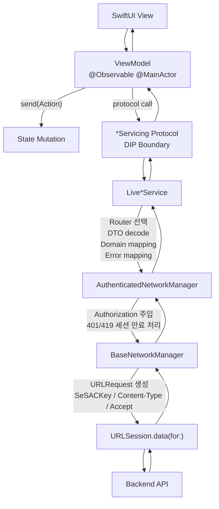

### UseCase 계층을 둔 기준
- **Service를 직접 호출하는 경우**: 홈, 피드, 커뮤니티처럼 서버 데이터를 조회하고 화면 상태로 반영하는 단순 흐름은 ViewModel이 `*Servicing` 프로토콜을 직접 사용
- **UseCase로 감싸는 경우**: 여러 서비스 호출, 로컬 저장소, 렌더러, 압축기, 결제 SDK처럼 서로 다른 책임이 하나의 사용자 행동 안에 묶일 때 UseCase로 분리
- **역할 구분**:
  - ViewModel: 화면 상태, 사용자 액션, 로딩/실패/라우팅 처리
  - UseCase: 앱 정책과 작업 순서 조합
  - Service: 서버 API 요청, 응답 해석, DTO와 도메인 모델 변환

| UseCase | 포함한 정책 |
|---|---|
| `LiveFilterMakeSubmitUseCase` | 대표 이미지 필수 검증, 필터 값 렌더링, 원본/적용 이미지 업로드, 필터 생성/수정 분기 |
| `LiveFilterMediaApplyUseCase` | 이미지/비디오 타입 분기, CoreImage 필터 적용, 비디오 export, 업로드 선택 객체 생성 |
| `LiveImageCompressionUseCase` | 이미지 유효성 검증, thumbnail 기반 크기 축소, JPEG 품질 조정, preset별 최대 용량 보장 |
| `LiveImageUploadUseCase` | 업로드 개수 제한, 이미지 JPEG 압축, MOV to MP4 변환, 파일명/확장자/MIME type 정규화, multipart part 생성 |
| `LiveFilterPurchaseUseCase` | 중복 구매 차단, 서버 주문 생성, PortOne 결제 요청 생성, PG 응답 검증, 서버 결제 검증 |
| `LivePurchasedFilterSyncUseCase` | 서버 주문 이력과 로컬 저장소 비교, 누락 필터만 병렬 상세 조회, SwiftData 저장 |
| `LiveProfileUseCase` | 프로필 수정 draft 정규화, 빈 문자열 `nil` 변환, 프로필 이미지 업로드 정책 재사용 |

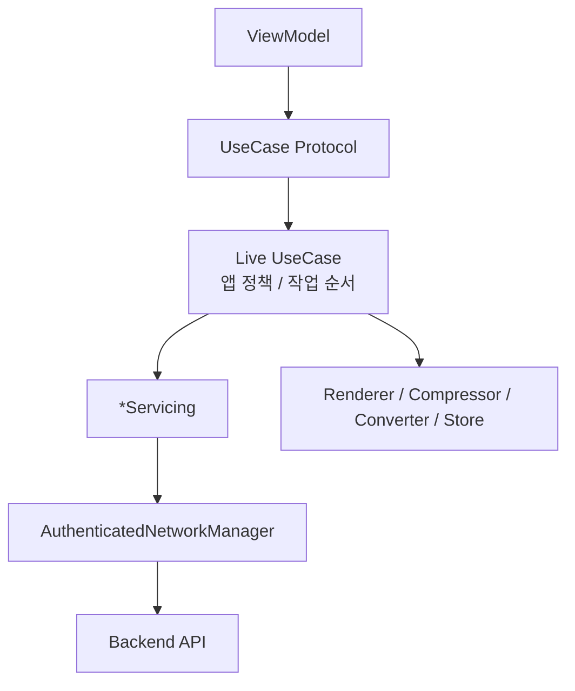

### 아키텍처 선택 이유

**Coordinator 도입 이유**
- **문제**: 필터 상세 화면 → 커뮤니티 작성 화면 이동, 푸시 알림에서 앱 진입 후 채팅방 직진 등 순수 NavigationStack만으로 처리 불가능한 복잡한 화면 전환 필요
- **선택**: AppCoordinator가 전체 네비게이션 흐름을 관리, 각 탭은 자체 라우트 enum으로 로컬 이동만 담당
- **결과**: View는 다른 View의 존재를 모르게 유지 가능, 딥링크와 크로스탭 이동을 일관되게 처리 가능

**MVVM → MVI 전환 이유**
- **초기 구조**: MVVM으로 시작했으나 SwiftUI에서 양방향 바인딩의 실질적 효용이 낮음
- **문제**: ViewModel이 거대한 비즈니스 로직 파일로 변질, 상태 변화 흐름이 복잡해짐
- **선택**: Send + Action enum 구성으로 단방향 데이터 흐름(MVI)으로 전환. ViewModel 명명은 유지해 기존 코드와의 호환성 확보
- **결과**: (1) 상태 변화 흐름이 명확해져 버그 추적 용이 (2) 상태 테스트가 간단해짐 (3) View가 순수하게 상태를 렌더링만 함

---

## 7. 폴더 구조

```text
Oh-My-Filter/
├── Oh-My-Filter/                  # 메인 앱 번들
│   ├── Oh_My_FilterApp.swift      # @main 앱 진입점
│   ├── AppDelegate.swift          # 앱 생명주기
│   ├── ContentView.swift          # 루트 뷰
│   │
│   ├── App/                       # 앱 수준 관리
│   │   ├── AppCoordinator.swift   # 전체 네비게이션 조율
│   │   ├── AppScene.swift         # 인증 vs 메인 씬 분기
│   │   └── Routers/               # 각 탭별 라우팅
│   │
│   ├── Data/                      # 네트워크, 저장소, 인증
│   │   ├── ApiRouters/            # API 엔드포인트 분류
│   │   │   ├── AuthApiRouter.swift
│   │   │   ├── HomeApiRouter.swift
│   │   │   ├── FilterApiRouter.swift
│   │   │   ├── ChatApiRouter.swift
│   │   │   ├── CommunityApiRouter.swift
│   │   │   ├── OrderApiRouter.swift
│   │   │   └── ...
│   │   ├── Auth/                  # Keychain 토큰, 인증 관리
│   │   ├── Constants/             # API 엔드포인트, SDK 키
│   │   ├── DTOs/                  # Codable 응답 모델
│   │   ├── Network/               # URLSession 기반 클라이언트
│   │   └── Notifications/         # Firebase Messaging 라우팅
│   │
│   ├── DesignSystem/              # 디자인 토큰, 공용 컴포넌트
│   │   ├── Colors/
│   │   ├── Typography/
│   │   ├── Icons/
│   │   └── Components/
│   │
│   ├── Features/                  # 화면별 기능 모듈
│   │   ├── AuthFlow/              # 인증 플로우 (로그인/회원가입)
│   │   ├── Login/
│   │   ├── Signup/
│   │   ├── Main/                  # 홈 화면 (오늘의 필터 등)
│   │   ├── Feed/                  # 필터 피드 (전체 필터 목록)
│   │   ├── FilterDetail/          # 필터 상세 (미리보기, 구매, 댓글)
│   │   ├── FilterEdit/            # 필터 파라미터 편집기
│   │   ├── MakeFilter/            # 필터 제작 및 수정
│   │   ├── Payment/               # Portone 결제
│   │   ├── Community/             # 커뮤니티 게시물
│   │   ├── Video/                 # 동영상 플레이어
│   │   ├── Chat/                  # Socket.IO 채팅
│   │   ├── Profile/               # 사용자 프로필
│   │   ├── Search/                # 검색
│   │   ├── Authenticated/         # 탭 뷰 (로그인 후)
│   │   ├── Shared/                # 공용 UI, 유틸리티, 렌더러
│   │   └── DesignSystemCatalog/   # 디자인 시스템 브라우저
│   │
│   └── Tests/                     # 단위 테스트, UI 테스트
│
├── Oh-My-Filter.xcodeproj/        # Xcode 프로젝트
├── CLAUDE.md                      # 개발자/에이전트 가이드
└── README.md                      # 이 파일
```

### 구조 설명
- **App/**: 앱 시작점, 코디네이터, 인증/메인 씬 분기
- **Data/**: 네트워크 통신, 토큰 관리, API 라우터, DTO 모델
- **DesignSystem/**: 색상, 폰트, 아이콘, 공용 UI 컴포넌트
- **Features/**: 화면 기능별 독립 모듈 (각각 View + ViewModel + Action + State + Route)
- **Tests/**: 단위 테스트, UI 테스트 (XCTest)

---

## 8. 실행 방법

### 사전 요구사항
- **Xcode**: 15.0 이상 (Swift 6.2 지원)
- **iOS Deployment Target**: iOS 26.0 이상
- **Swift Version**: 6.2 이상 (strict concurrency)
- **의존성 관리**: Swift Package Manager (SPM)
- **필수 설정 파일**:
  - `GoogleService-Info.plist` (Firebase Messaging)
  - Kakao SDK AppKey (Info.plist 또는 xcconfig)
  - Portone/iamport API Key (서버 환경변수)

### 설치 및 실행
1. **저장소 클론**
```bash
git clone https://github.com/sunkeydokey/Oh-My-Filter.git
cd Oh-My-Filter
```

2. **Xcode로 프로젝트 열기**
```bash
open Oh-My-Filter.xcodeproj
```
(SPM 의존성은 Xcode가 자동으로 해결)

3. **환경 설정**
   - `GoogleService-Info.plist` 추가 (Firebase 프로젝트에서 다운로드)
   - Kakao SDK AppKey → `Info.plist` 또는 `Constants` 파일에 설정
   - Portone Key → 백엔드 서버와 동기화

4. **시뮬레이터 또는 디바이스에서 실행**
   - Xcode에서 대상 시뮬레이터/디바이스 선택 후 `Cmd + R` 빌드 및 실행

### 주의사항
- **민감 정보 보호**: API 키, 토큰 등은 저장소에 포함하지 않음
  - `Constants/ApiKeys.swift` (로컬에만 존재) 또는 환경변수로 관리
- **권한 설정**: 
  - **카메라 롤 접근** (`PHPhotoLibrary`) — 사진 선택 및 저장 시 필요
  - **카메라 접근** (`AVCaptureDevice`) — 필터 미리보기 촬영 시 필요
  - **알림** (`UNUserNotification`) — 푸시 알림 수신 시 필요
- **네트워크 설정**: 백엔드 API 엔드포인트는 `Data/Constants/Endpoint.swift`에서 확인 및 수정

---

## 9. 주요 구현 내용

### 화면 설계
- **주요 화면**: 14개 주요 화면 (로그인 → 홈 → 필터 시장 → 필터 상세 → 필터 편집 → 커뮤니티 → 채팅 → 프로필)
- **화면 흐름 설계 기준**: 
  - Bottom Tab Navigation으로 메인, Feed, 커뮤니티, Chat, Profile 5개 탭 분리
  - 각 탭 내에서 NavigationStack으로 로컬 이동 (상세, 편집 등)
  - 특정 액션(필터 구매 → 커뮤니티 공유)은 Coordinator가 크로스탭 이동 처리
- **네비게이션 처리 방식**: 
  - AppCoordinator가 전체 플로우 조율
  - 각 Feature의 `Route` enum으로 로컬 네비게이션 모델링
  - 푸시 알림 딥링크는 서버 응답 페이로드를 파싱해 route로 변환

### 상태 관리
- **단방향 데이터 흐름**: MVVM 명명은 유지하되, 실제 화면 로직은 Store-like MVI 흐름으로 구성
- **입력/출력 구조**:
  - Input: `send(_ action: Action)` — 사용자 입력, 생명주기 이벤트, 재시도 이벤트를 하나의 진입점으로 수신
  - Store: ViewModel이 Action을 해석하고 API 호출, 이미지 렌더링, 결제 검증 등 side effect를 오케스트레이션
  - Output: `@Observable` State 변경 → SwiftUI View가 상태를 기준으로 자동 리렌더링
- **상태 분리 전략**:
  - Feature별로 `Action`, `State`, `ViewModel`, `Route`를 분리해 화면 로직의 입력과 결과를 명시
  - 홈 화면은 `todayFilter`, `mainBanners`, `hotTrendFilters`, `todayAuthor`처럼 섹션별 상태를 나눠 독립 로딩/실패/재시도 처리
  - View는 전체 State를 직접 다루기보다 필요한 state slice와 action closure만 하위 섹션에 전달해 불필요한 리렌더링 범위를 축소
- **비동기 처리 방식**: `async/await` (Combine 미사용)
  - 네트워크 요청, 파일 I/O, 필터 렌더링 모두 async/await로 구현
  - @MainActor로 UI 업데이트 스레드 안전성 보장

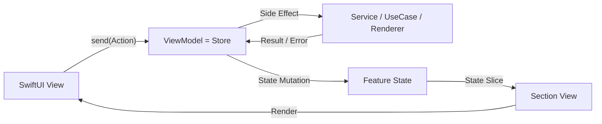

### 네트워크
- **API 통신 방식**: URLSession 기반 REST API (커스텀 네트워크 레이어)
  - `NetworkManager`: 기본 HTTP 요청 처리, 에러 매핑
  - `AuthenticatedNetworkManager`: 요청 직전 토큰 유효성 보장 + 인증 헤더 주입
  - 각 Feature의 `ApiRouter`: 도메인별 엔드포인트 정의
- **에러 처리 전략**:
  - HTTP 상태 코드별 커스텀 에러 타입 매핑
  - 401/419 인증 실패 응답 시 토큰 삭제 후 세션 만료 에러로 변환
  - 네트워크 연결 실패 시 사용자 피드백 제공
- **RTR(Refresh Token Rotation) 기반 토큰 갱신**:
  - `AuthenticatedNetworkManager`는 인증 요청 직전 `TokenRefreshCoordinator.authorizationHeaderValue()`를 호출해 유효한 access token을 확보한 뒤 `Authorization` 헤더에 주입
  - `TokenRefreshCoordinator`는 actor로 구현해 토큰 검증과 갱신 진입점을 직렬화하고, 여러 요청이 동시에 들어와도 공유 상태인 `refreshTask`에 안전하게 접근
  - refresh token이 이미 만료된 경우 서버 요청 없이 `clearTokens()`로 저장 토큰을 삭제하고 `expiredRefreshToken` 에러를 반환
  - access token의 남은 시간이 기본 90초 미만이면 요청 전에 선제적으로 refresh를 수행하고, 90초 이상 남아 있으면 기존 access token을 그대로 사용
  - refresh 요청은 기존 `RefreshToken`과 `Authorization` 헤더를 함께 보내고, 성공 시 서버가 내려준 새 access token과 새 refresh token을 Keychain에 저장해 RTR 정책을 반영
  - refresh 중인 작업이 이미 있으면 새 refresh를 시작하지 않고 기존 `refreshTask.value`를 기다리게 하여 refresh token 중복 사용과 토큰 데이터 경합을 방지
  - refresh 실패 또는 완료 후에는 `refreshTask`를 `nil`로 정리해 이후 요청이 필요한 경우 다시 갱신을 시도할 수 있도록 처리
  - 인증 API 응답이 `401` 또는 `419`이면 토큰을 삭제하고 세션 만료 에러로 변환해 재로그인 흐름으로 이어지게 처리

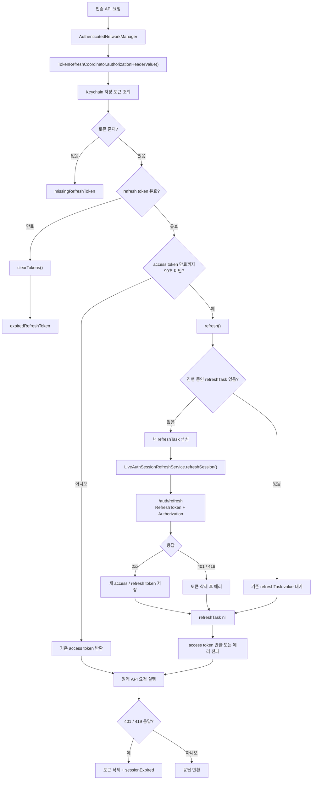

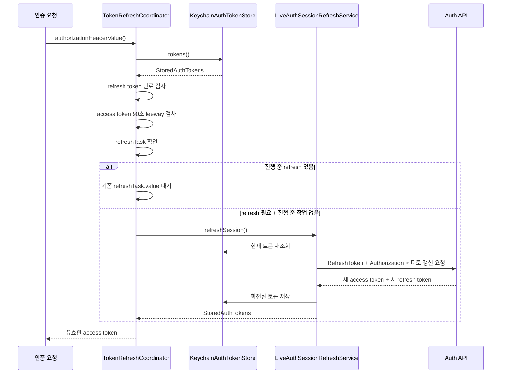

### CoreML 기반 변환 이미지 제공
- **구현 목적**: 사용자가 필터 대표 이미지 또는 커뮤니티 첨부 이미지를 선택했을 때, 서버 업로드 없이 디바이스 안에서 AnimeGAN 스타일의 변환 이미지를 생성하고 원본과 비교한 뒤 사용할 수 있도록 제공
- **핵심 구성**:
  - `animeganHayao.mlmodel`: 앱 번들에 포함된 CoreML 변환 모델
  - `AnimeGANConverting`: 변환 기능을 추상화한 프로토콜로, 필터 생성 화면과 커뮤니티 화면에서 같은 변환 파이프라인을 재사용
  - `LiveAnimeGANConverter`: ImageIO, CoreML, CoreImage를 조합해 이미지 디코딩, 모델 추론, 결과 이미지 복원, JPEG 인코딩을 담당
  - `FilterMakeViewModel`: 대표 이미지 변환 상태를 관리하고, 사용자가 변환본을 선택하면 대표 이미지 데이터를 교체
  - `CommunityPostViewModel`: 로컬 선택 이미지 변환, 원격 이미지 변환 후 앨범 저장 흐름을 같은 converter로 처리
  - `AnimeConversionPreviewSheet`: 원본과 변환본을 나란히 보여주고 "변환본 사용" 또는 "원본 유지" 선택을 제공
- **변환 처리 흐름**:
  - 원본 `Data`를 `CGImageSource`로 디코딩하고, orientation을 반영한 thumbnail을 생성
  - 모델 입력 비용을 제한하기 위해 `maxPixelSize`를 512로 두고, CoreML generated input initializer가 모델 입력 크기인 256x256 pixel buffer로 변환
  - `animeganHayao().prediction(input:)`으로 온디바이스 추론을 실행
  - 출력 `CVPixelBuffer`를 `CIImage`로 감싼 뒤 `CIContext`로 `CGImage`를 생성
  - 모델 출력 크기인 256x256 이미지를 원본 thumbnail 크기에 맞춰 `CILanczosScaleTransform`으로 업스케일
  - 변환 결과를 JPEG 품질 0.92로 인코딩해 업로드/저장 가능한 `Data`로 반환
- **비동기 상태 관리**:
  - 모델 추론과 이미지 변환은 `Task.detached(priority: .userInitiated)`에서 실행해 UI thread 점유를 줄임
  - ViewModel은 `animeConversionTask`와 `animeConversionRequestID`를 함께 관리해 새 이미지 선택, 취소, 재요청 시 이전 작업 결과가 최신 상태를 덮어쓰지 않도록 방지
  - 실패 원인은 `invalidImageData`, `modelLoadFailed`, `predictionFailed`, `outputDecodingFailed`로 분리해 사용자 메시지로 변환
- **양자화 검토**:
  - 현재 앱 런타임 파이프라인에는 모델 양자화 단계가 포함되어 있지 않음. 앱은 이미 번들에 포함된 `animeganHayao.mlmodel`을 로드해 추론만 수행
  - 양자화는 런타임 이미지 처리 단계가 아니라 CoreML 모델을 앱에 포함하기 전의 모델 준비/빌드 전처리 단계에 해당
  - 이미지 변환 모델은 분류 모델보다 결과 품질 저하가 눈에 잘 보이므로, FP16 또는 INT8 weight quantization을 적용할 경우 색감 변화, 디테일 손실, 경계 아티팩트, 스타일 강도 변화를 대표 이미지 세트로 비교 검증해야 함
  - 안정적인 적용 순서는 원본 모델 기준 품질 확보 → FP16 경량화 검증 → 필요 시 INT8 또는 palettization 검토 순서가 적합

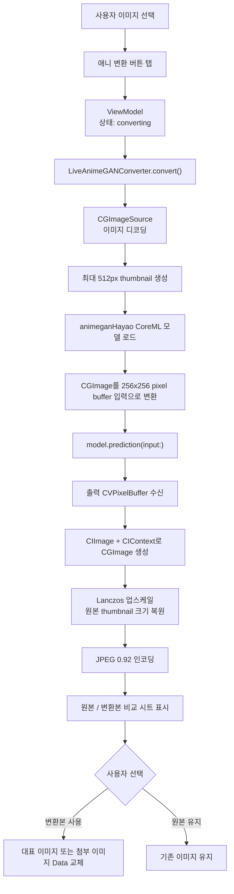

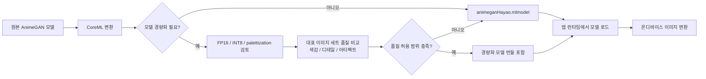

> 포트폴리오 설명 포인트: CoreML 기반 AnimeGAN 모델을 앱 번들에 포함해 네트워크 업로드 없이 온디바이스 이미지 변환을 제공했습니다. ImageIO로 입력 이미지를 thumbnail로 제한하고, CoreML 추론 결과를 CoreImage로 디코딩 및 Lanczos 업스케일한 뒤 JPEG 데이터로 재사용했습니다. 변환 작업은 Swift Concurrency 기반 비동기 Task와 requestID 검증으로 관리해 취소되거나 오래된 결과가 UI 상태를 덮어쓰지 않도록 처리했습니다. 모델 양자화는 현재 런타임 파이프라인에는 포함하지 않았으며, 적용 시에는 모델 준비 단계에서 품질 저하를 별도로 검증해야 하는 항목으로 분리했습니다.

### RangedRequest를 통한 동영상을 포함한 포스트 미리보기 기능
- **구현 목적**: 커뮤니티 게시글에 이미지뿐 아니라 동영상 파일도 첨부될 수 있으므로, 피드와 상세 화면에서 첨부 파일 타입에 맞는 미리보기를 제공. 동영상은 전체 파일을 먼저 내려받지 않고 AVFoundation의 byte-range 기반 로딩에 위임해 초기 표시 지연과 네트워크 사용량을 줄임
- **핵심 구성**:
  - `LiveCommunityService`: `/posts/geolocation`, `/posts/{postID}` 응답을 조회하고 `CommunityPostDTO`를 도메인 모델로 변환
  - `CommunityPostDTO`: 서버가 내려준 `files` 배열의 확장자를 기준으로 이미지와 동영상을 `CommunityAttachment.image(URL)` / `CommunityAttachment.video(URL)`로 분리
  - `CommunityFeedSectionView`: 게시글 첨부 파일을 carousel로 렌더링하고 현재 보이는 동영상만 active 상태로 전달
  - `PostVideoPreviewView`: active 상태일 때만 `AVPlayer`를 생성해 무음 자동 미리보기를 재생하고, 비활성화 또는 화면 이탈 시 즉시 해제
  - `AuthenticatedVideoAssetBuilder`: 인증이 필요한 동영상 URL을 재생할 수 있도록 `SeSACKey`, `Authorization` 헤더를 `AVURLAssetHTTPHeaderFieldsKey`에 주입
- **RangedRequest 처리 방식**:
  - 앱에서 `Range: bytes=...` 헤더를 직접 만드는 대신 `AVURLAsset → AVPlayerItem → AVPlayer` 구조를 사용
  - 서버가 `Accept-Ranges: bytes`를 지원하면 AVFoundation이 mp4/mov의 메타데이터와 초반 재생에 필요한 byte 구간부터 부분 요청
  - 사용자가 재생 위치를 이동하거나 버퍼가 더 필요해지면 AVPlayer가 필요한 구간만 추가 요청
  - 앱은 인증 헤더와 player 생명주기만 관리하고, 미디어 파일의 부분 다운로드/버퍼링/디코딩 스케줄링은 AVFoundation에 위임
- **UI blocking 최소화 전략**:
  - post 목록/상세 조회는 `LiveCommunityService`의 `async/await` 네트워크 요청으로 처리해 메인 스레드 대기를 만들지 않음
  - DTO 디코딩 단계에서 파일 타입을 미리 분류해 View에서는 복잡한 MIME 판별 없이 attachment enum만 렌더링
  - 피드 carousel의 현재 index와 일치하는 동영상에만 player를 생성해 동시에 여러 동영상이 디코딩되지 않도록 제한
  - `PostVideoPreviewView`는 placeholder를 먼저 표시하고 `.task(id: isActive)`에서 비동기 player setup을 수행
  - 화면 이탈 또는 비활성화 시 observer 제거, 재생 중지, player nil 처리를 즉시 수행해 스크롤 중 리소스 점유를 최소화
  - 피드 미리보기는 무음 재생 후 15초 뒤 자동 pause 처리해 사용자가 오래 머무르는 화면에서도 불필요한 네트워크/디코딩 비용을 제한
- **사용자 경험 개선 포인트**:
  - 이미지와 동영상이 섞인 게시글도 하나의 carousel에서 자연스럽게 탐색 가능
  - 동영상은 탭하기 전에도 첫 화면에서 자동 미리보기로 콘텐츠 성격을 빠르게 파악 가능
  - 인증이 필요한 원격 파일도 이미지 로딩과 동일한 사용자 경험으로 노출
  - 피드 스크롤 성능을 위해 보이는 영상만 재생하고, 상세 화면에서는 별도 컨트롤이 있는 player로 전환

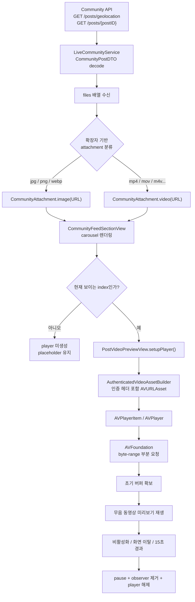

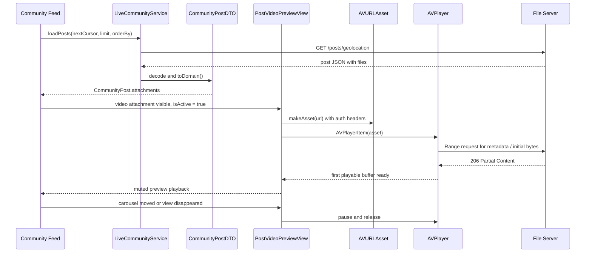

> 포트폴리오 설명 포인트: 커뮤니티 post의 첨부 파일을 도메인 모델에서 이미지/동영상으로 분리하고, 동영상은 `AVURLAsset`에 인증 헤더만 주입한 뒤 AVFoundation의 ranged request 기반 스트리밍에 맡겼습니다. 피드에서는 현재 노출 중인 item에만 player를 생성하고 화면 이탈 시 즉시 해제해 스크롤 성능과 UI 응답성을 유지했습니다.

### Socket.IO 기반 채팅 기능
- **구현 목적**: 판매자와 구매자가 필터 구매 전후에 실시간으로 문의하고 응답할 수 있도록 1:1 채팅 기능을 구성. 네트워크가 불안정하거나 앱이 백그라운드에서 복귀한 상황에서도 메시지 유실 가능성을 줄이기 위해 REST 동기화, Socket.IO 실시간 수신, SwiftData 로컬 저장을 함께 사용
- **핵심 구성**:
  - `ChatListViewModel`: 채팅방 목록, 사용자 검색, 방 생성, 읽지 않은 대화 필터링 관리
  - `ChatViewModel`: 채팅방 화면 상태, 메시지 로딩/전송/재시도, 소켓 이벤트 처리 오케스트레이션
  - `LiveChatService`: 채팅방 목록, 메시지 동기화, 파일 업로드, 메시지 전송 REST API 담당
  - `SocketIOChatSocketManager`: Socket.IO 연결, `chat` 이벤트 수신, 연결/해제/재연결 이벤트 전달
  - `SwiftDataChatStore`: 채팅방과 메시지를 로컬에 저장해 오프라인 열람과 재동기화 지원
- **채팅방 진입 흐름**:
  - 채팅방 진입 시 SwiftData에 저장된 메시지를 먼저 표시해 초기 화면 응답성을 확보
  - 가장 최신 로컬 메시지의 `createdAt`을 기준으로 `/chats/{roomID}?next=...` API를 호출해 누락 메시지만 동기화
  - 동기화 이후 Socket.IO 네임스페이스 `/chats-{roomID}`에 연결하고 실시간 수신 대기
  - 화면을 벗어나면 소켓 핸들러를 제거하고 연결을 종료해 불필요한 이벤트 수신을 방지
- **메시지 전송 흐름**:
  - 사용자가 입력한 텍스트는 공백 제거 후 비어 있으면 전송하지 않음
  - 이미지가 첨부된 경우 먼저 `/chats/{roomID}/files`로 업로드해 서버 파일 경로를 획득
  - 텍스트와 파일 경로를 `/chats/{roomID}` 전송 API로 전달하고, 성공 응답을 SwiftData에 저장한 뒤 화면을 갱신
  - 전송 실패 시 입력 내용과 선택 이미지를 `ChatPendingMessageAlert`에 보관해 삭제 또는 다시 시도를 선택할 수 있도록 처리
- **실시간 수신 흐름**:
  - Socket.IO의 `chat` 이벤트 payload를 `ChatResponseDTO`로 디코딩
  - 도메인 모델 `ChatMessage`로 변환한 뒤 SwiftData에 upsert
  - 로컬 저장소를 다시 조회해 메시지 목록을 갱신하고, 해당 방의 `lastSeenAt`을 업데이트
- **재연결 및 유실 보정**:
  - 비정상 disconnect가 발생하면 `ReconnectionManager`가 1초, 2초, 4초, 8초처럼 exponential backoff 방식으로 재연결을 예약
  - 최대 재시도 횟수를 넘기면 연결 실패 상태를 표시해 사용자에게 현재 상태를 명확히 전달
  - 재연결 성공 또는 앱 foreground 복귀 시 REST 메시지 동기화를 다시 수행해 끊긴 동안 수신하지 못한 메시지를 보정
- **Socket.IO 선택 이유**:
  - 이 앱은 `.forceWebsockets(true)` 설정으로 실제 전송 계층은 WebSocket을 사용하지만, 일반 WebSocket을 직접 다루는 대신 Socket.IO 프로토콜의 namespace, event, connection lifecycle 모델을 활용
  - 채팅방별 namespace(`/chats-{roomID}`)와 `chat` 이벤트를 사용해 방 단위 실시간 수신 로직을 명확히 분리
  - Socket.IO의 하위 Engine.IO가 ping/pong heartbeat를 내부적으로 처리하므로 앱에서 별도 heartbeat 메시지를 직접 구현하지 않아도 됨
  - 직접 WebSocket 프로토콜을 설계할 때 필요한 이벤트 타입 분기, 연결 상태 이벤트, heartbeat 처리 규칙을 라이브러리와 서버 프로토콜에 위임하고, 앱은 메시지 저장/상태 갱신/재동기화 로직에 집중
- **포트폴리오 설명 포인트**:
  - REST API는 메시지 전송과 파일 업로드처럼 서버 검증과 명확한 요청/응답이 필요한 작업에 사용
  - Socket.IO는 서버가 새 메시지를 push하는 실시간 수신 채널로 사용
  - SwiftData는 로컬 우선 표시와 오프라인 열람, 재연결 후 동기화의 기준점으로 사용
  - Socket.IO heartbeat와 앱 자체 exponential backoff 재연결, REST 재동기화를 조합해 실시간성과 데이터 일관성을 함께 확보

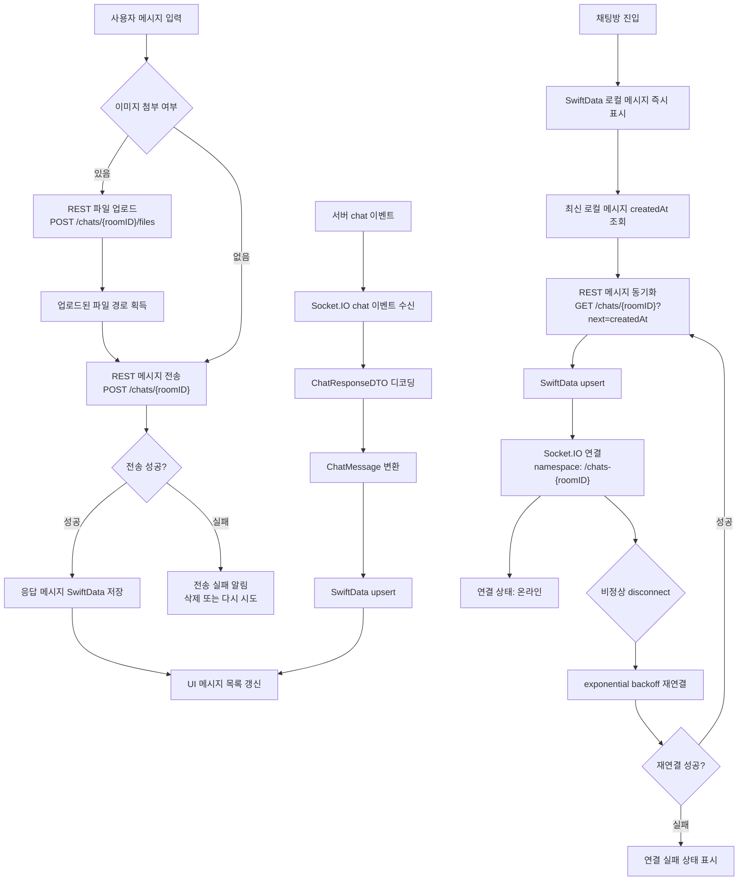

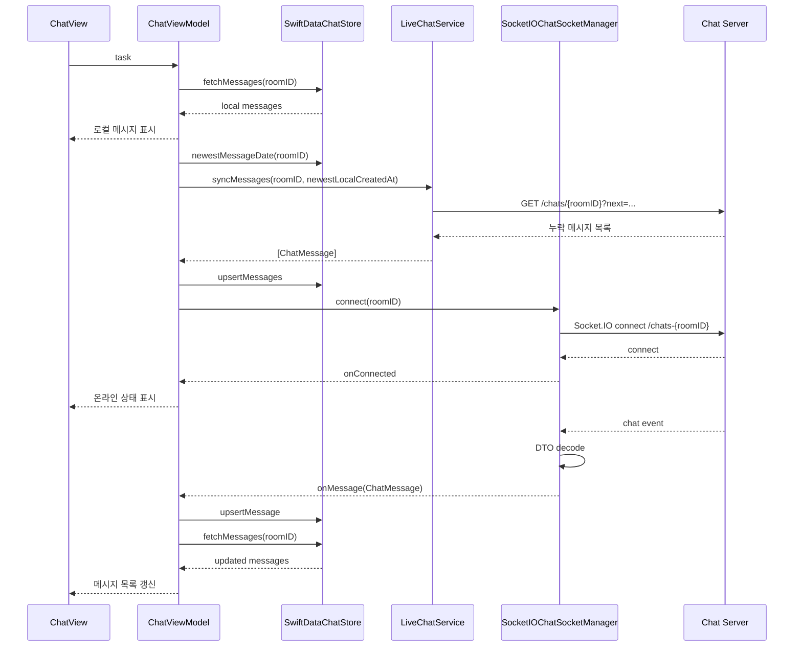

### HLS 기반 스트리밍 및 오프라인 저장
- **구현 목적**: 커뮤니티에 공유된 동영상을 네트워크 상태에 맞춰 안정적으로 재생하고, 사용자가 필요한 영상을 로컬에 저장해 이후에는 네트워크 없이 재생할 수 있도록 구성
- **핵심 구성**:
  - `VideoPlayerViewModel`: 재생 상태, 화질, 자막, 전체 화면, 오프라인 저장 상태를 Action 기반으로 관리
  - `LiveVideoPlayerService`: `/videos/{id}/stream` API를 호출해 HLS URL, 화질 목록, 자막 메타데이터를 로드
  - `LiveVideoDownloadManager`: `AVAssetDownloadURLSession`으로 HLS 패키지를 백그라운드 다운로드
  - `SwiftDataOfflineVideoStore`: 다운로드된 `.movpkg`의 상대 경로와 저장 메타데이터를 SwiftData에 저장
- **스트리밍 진입 흐름**:
  - 비디오 상세 진입 시 먼저 `OfflineVideoRecord`를 조회
  - 저장된 로컬 파일이 있으면 Documents 디렉터리의 `.movpkg`를 `AVPlayer`에 연결
  - 저장본이 없으면 서버에서 HLS 스트림 메타데이터를 받아 선택 화질 URL로 `AVURLAsset → AVPlayerItem → AVPlayer`를 구성
- **버퍼 기반 화질 전환**:
  - 화질 선택 시 현재 재생 위치와 `loadedTimeRanges`의 버퍼 끝을 비교
  - 남은 버퍼가 짧으면 즉시 새 화질 `AVPlayerItem`으로 교체하고 현재 시점으로 seek
  - 남은 버퍼가 충분하면 새 `AVURLAsset`을 미리 로드하고, 버퍼 경계 직전에 boundary observer로 자연스럽게 교체
  - 지연 전환 중 사용자가 seek하면 예약된 전환을 취소하고 선택 화질로 즉시 교체해 상태 불일치를 방지
- **오프라인 저장 흐름**:
  - 현재 재생 중인 HLS URL을 `AVAssetDownloadTask`로 다운로드
  - delegate 콜백의 진행률, 완료, 실패, 취소 이벤트를 `AsyncStream<VideoDownloadEvent>`로 ViewModel에 전달
  - 다운로드 완료 시 임시 위치의 파일을 `Documents/{videoId}.movpkg`로 이동하고 SwiftData에 `OfflineVideoRecord` 저장
  - 저장 완료 이벤트를 받으면 `offlineState = .saved`로 전환하고, 현재 재생 위치를 유지한 채 로컬 파일로 player item을 교체
- **사용자 경험 개선 포인트**:
  - 스트리밍과 오프라인 재생을 같은 플레이어 상태 모델로 처리해 UI 분기 최소화
  - 다운로드 중에는 상단 버튼을 progress indicator로 바꾸고, 저장 완료 후 "오프라인" 메타데이터를 표시
  - 백그라운드 진입 시 재생을 일시정지하고 pending quality change와 컨트롤 자동 숨김 task를 정리

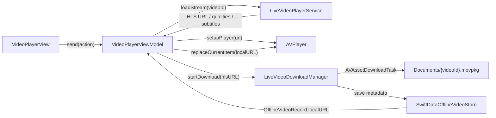

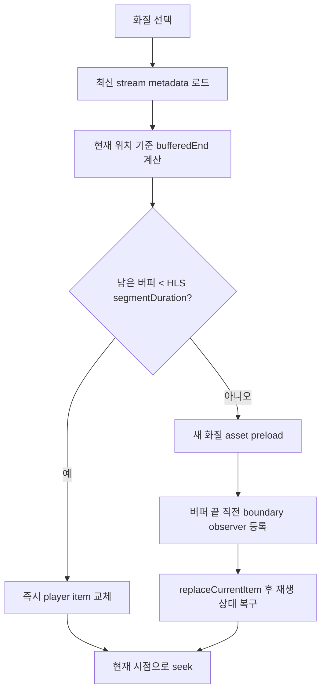

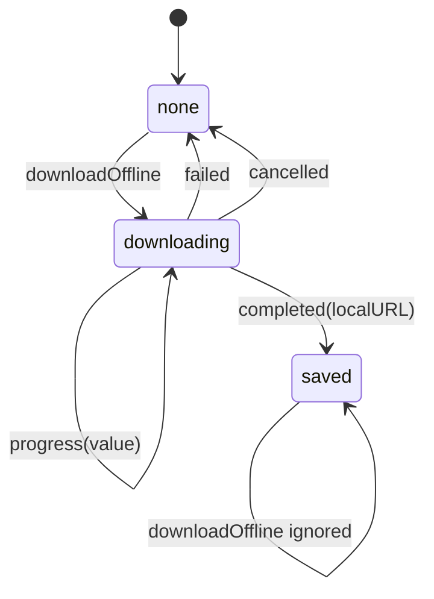

### 웹뷰 기반의 웹이벤트 연동
- **구현 목적**: 홈 배너를 통해 서버가 제공하는 웹 이벤트 페이지를 앱 안에서 자연스럽게 노출하고, 출석 이벤트 완료 상태는 네이티브 UI로 피드백
- **진입 조건**:
  - 메인 배너 API 응답의 `payload.type`이 `WEBVIEW`인 경우에만 웹뷰 진입 URL 생성
  - `payload.value`는 `Server.webViewBaseUrl()`과 조합해 실제 웹 이벤트 URL로 변환
  - 배너 카드 탭 시 `webViewURL`이 존재하는 배너만 `fullScreenCover`로 표시
- **앱-웹 통신 방식**:
  - `BannerWebView`: SwiftUI에서 UIKit 기반 웹뷰 컨트롤러를 사용할 수 있도록 `UIViewControllerRepresentable`로 래핑
  - `WKUserContentController`: 웹 페이지에서 전달하는 JavaScript message를 네이티브 앱에서 수신
  - `click_attendance_button`: 웹에서 출석 버튼 클릭 시 앱에 인증 토큰 요청
  - `complete_attendance`: 웹에서 출석 완료 후 앱에 완료 횟수 전달
- **인증 토큰 전달 전략**:
  - 웹 페이지가 토큰 저장소에 직접 접근하지 않도록 설계
  - 출석 버튼 클릭 이벤트를 받은 시점에 앱이 `AppTokenRefreshCoordinator`로 유효한 인증 헤더 값을 요청
  - 앱은 `evaluateJavaScript("requestAttendance(...)")`로 웹 페이지의 출석 요청 함수에 토큰을 주입
- **완료 처리**:
  - 웹에서 `complete_attendance` 메시지를 보내면 앱은 `message.body`에서 출석 횟수를 추출
  - `onComplete(count)` 클로저를 통해 SwiftUI 상태를 갱신하고 웹뷰를 닫음
  - `CustomAlertSingleButtonView`로 "출석 완료" 알림을 표시해 웹 이벤트 결과를 네이티브 UX로 마무리
- **안정성 처리**:
  - 웹뷰 로딩 요청에는 `SeSACKey` 헤더를 포함해 서버 요구사항 충족
  - `deinit`에서 등록한 script message handler를 제거해 웹뷰 해제 후 메시지 핸들러가 남지 않도록 처리
  - 닫기 버튼은 `onDismiss` 클로저로 SwiftUI 상태를 정리해 화면 표시 상태와 실제 웹뷰 생명주기를 일치시킴

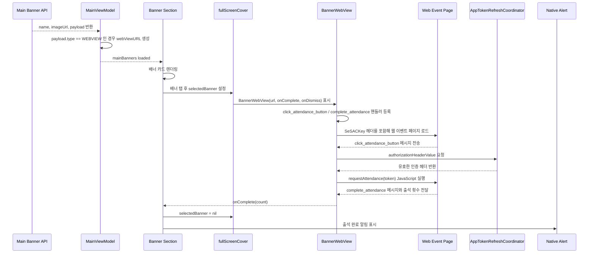

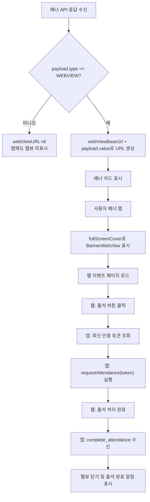

### PG 결제 연동 및 무결성 검사
- **결제 방식**: PortOne PG SDK 기반 카드 결제 + 백엔드 서버 검증
  - `LiveOrderService`: 결제 전 서버 주문 생성
  - `PortoneWebView`: PortOne SDK 결제창 표시 및 PG 응답 수신
  - `LiveFilterPurchaseUseCase`: 주문 생성, PG 응답 검증, 서버 결제 검증 흐름 조합
  - `LivePaymentService`: PG 승인 번호(`imp_uid`)를 백엔드 검증 API로 전달
- **무결성 검사 전략**:
  - 클라이언트에서 PG 성공 응답을 바로 구매 완료로 처리하지 않음
  - 서버에서 발급한 `orderCode`를 PG 요청의 `merchantUID`로 사용해 앱 주문과 PG 거래를 연결
  - PG 결제 완료 후 받은 `imp_uid`를 `/payments/validation` API로 전송
  - 백엔드가 주문 번호, 결제 승인 번호, 결제 금액을 기준으로 최종 검증한 뒤 구매 상태 확정
- **에러 처리**:
  - PG 실패 응답은 `FilterPurchaseError.paymentFailed`로 변환해 사용자에게 결제 실패 사유 안내
  - `imp_uid`가 없으면 승인 정보 누락으로 판단해 서버 검증 요청 차단
  - 네트워크 오류와 서버 검증 실패는 `PaymentServiceError.transport`, `PaymentServiceError.validationFailed`로 분리
  - 400 응답은 서버 message를 로그로 남기되, 사용자에게는 안정적인 로컬라이즈 메시지 제공
- **상태 동기화**:
  - 서버 검증 성공 후 필터 상세 정보를 다시 조회해 구매 완료 여부를 서버 상태 기준으로 반영
  - 결제 요청 중 `isPaymentProcessing`, `paymentRequest` 상태로 중복 결제창 표시와 중복 요청 방지

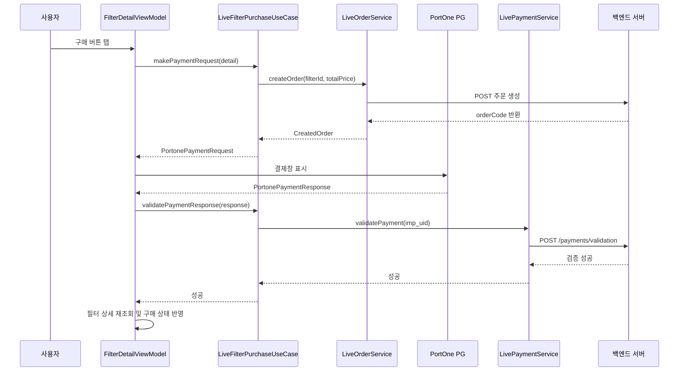

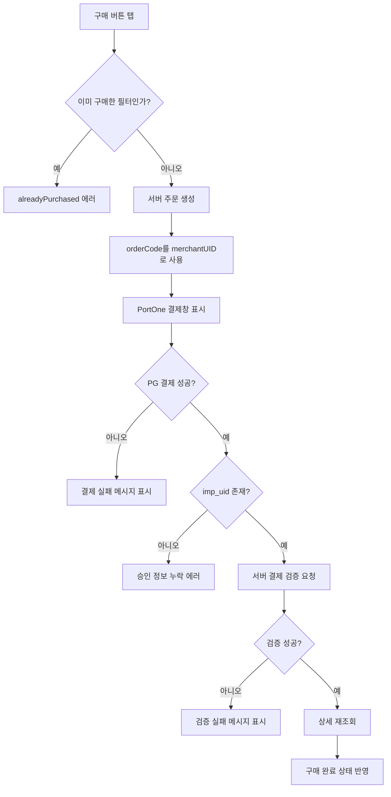

### 로컬 저장
- **JWT 토큰**: Keychain (보안 저장소) — 로그인/로그아웃 시 자동 관리
- **채팅 메시지**: SwiftData (로컬 DB) — 메시지 히스토리 오프라인 열람, 재연결 시 싱크
- **사용자 세션**: Memory (`@Observable` 상태) — 비휘발성 데이터는 불필요, 시작 시 서버 검증
- **이미지 캐시**: Kingfisher (메모리 + 디스크 캐시) — 필터 썸네일, 프로필 이미지 등

### 성능/품질
- **메모리 관리**: 
  - `@MainActor` 클래스로 대기열 접근 방지
  - 이미지 로드 시 downsampling으로 메모리 절약
  - 필터 비교 미리보기는 `maxPixelSize`를 제한해 렌더링 픽셀 예산 축소
- **필터 렌더링 안정성**:
  - 필터값을 `FilterValues` 구조체로 정규화한 뒤 고정 CoreImage 파이프라인에 적용
  - 사용자가 슬라이더를 어떤 순서로 조정해도 같은 필터값 조합이면 같은 순서로 렌더링
  - EXIF orientation을 먼저 보정한 뒤 필터를 적용해 원본 이미지 방향 유지
- **슬라이더 렌더링 부하 제어**:
  - 편집 화면 미리보기는 같은 `FilterValues`가 연속으로 들어오면 렌더링 생략
  - 새 슬라이더 값이 들어오면 이전 `renderTask`를 취소하고 80ms 뒤 최신 값만 렌더링
  - 필터 생성 화면의 전후 비교 미리보기는 슬라이더 변경에만 300ms debounce 적용
  - 비동기 렌더 완료 시 requestID를 검증해 오래 걸린 이전 결과가 최신 미리보기를 덮어쓰지 않도록 처리
- **이미지 캐싱**: Kingfisher로 1차 메모리, 2차 디스크 캐시
- **중복 요청 방지**: 
  - 네트워크 요청 진행 중 동일 요청 무시
  - 페이지네이션: 마지막 페이지 도달하면 추가 요청 중단
- **테스트 작성**: XCTest 단위 테스트 (주요 로직, ViewModel 상태 변화)

---

## 10. 기술적 의사결정

### 1) MVVM → MVI 아키텍처 전환
**문제**
- 초기에는 SwiftUI + MVVM 구조로 시작했지만, 화면이 커질수록 ViewModel 내부에 사용자 입력, 네트워크 요청, 라우팅, 에러 처리 로직이 섞이기 시작
- 양방향 바인딩 중심 구조에서는 어떤 사용자 입력이 어떤 상태 변경을 만들었는지 추적하기 어렵고, View가 비즈니스 상태를 직접 변경할 여지가 커짐

**선택**
- ViewModel 명명은 유지하되 역할을 Store에 가깝게 재정의
- View는 `send(_ action:)`으로 Action만 전달하고, ViewModel은 side effect 처리와 State 변경을 전담하는 단방향 흐름으로 전환

**이유**
- 모든 상태 변화가 `Action → Side Effect → State → View` 흐름 안에서 발생해 디버깅 지점이 명확함
- 테스트에서 특정 Action을 보냈을 때의 State 변화, 실패 상태, 라우트 발생 여부를 독립적으로 검증 가능
- View는 상태를 렌더링하고 Action을 전달하는 역할에 집중하므로 비즈니스 로직이 SwiftUI View에 흩어지지 않음
- 큰 화면은 state slice와 섹션 View로 나눠 특정 섹션 상태 변경이 다른 섹션의 불필요한 리렌더링으로 번지는 범위를 줄일 수 있음

**결과**
- 화면 로직의 입력과 출력이 명확해져 버그 원인 파악이 쉬워짐
- API 성공/실패, 재시도, 제출, 라우팅 같은 흐름을 Action 단위로 테스트 가능
- ViewModel은 이름만 MVVM을 유지하고, 실제로는 Store처럼 상태 소유와 side effect 오케스트레이션을 담당하는 구조로 정리됨

### 2) Coordinator 패턴으로 복잡한 네비게이션 관리
**문제**
- 탭 간 이동 (필터 구매 후 커뮤니티 작성), 푸시 딥링크 (채팅방 직진) 등 순수 NavigationStack으로 처리 불가능한 시나리오 다수
- View가 다른 View를 직접 알아야 해 의존성이 높아짐

**선택**
- AppCoordinator가 전체 네비게이션 플로우 조율, 각 탭은 로컬 Route enum만 관리

**이유**
- 복잡한 화면 전환을 한 곳(Coordinator)에서 관리 → 유지보수 용이
- View는 네비게이션 로직을 몰라도 됨 → 테스트 가능성 ↑
- 딥링크, 로그인 후 리다이렉트 등 다양한 진입점을 일관되게 처리

**결과**
- 새로운 화면 추가 시 기존 네비게이션 코드 수정 최소화
- 푸시 알림 딥링크 처리가 명확하고 안정적

### 3) DI 컨테이너 대신 명시적 생성자 주입
**문제**
- ViewModel, UseCase, Service가 모두 프로토콜 기반으로 분리되어 있어 의존성 주입은 필요했지만, 별도 DI 컨테이너를 도입하면 등록/해결 규칙과 전역 접근 지점이 추가됨
- 현재 앱의 의존성 그래프는 대부분 화면 또는 UseCase 단위로 닫혀 있고, 각 객체가 필요로 하는 의존성 수가 제한적임

**선택**
- 별도 DI 컨테이너를 두지 않고 생성자 주입과 기본 구현체 제공으로 구성
- ViewModel은 `any *Servicing` 또는 UseCase 프로토콜을 생성자로 받고, 기본 생성자에서만 `Live*Service`, `Live*UseCase`를 연결
- 테스트에서는 컨테이너 resolve 없이 mock 객체를 직접 주입

**이유**
- DI의 핵심 목적인 교체 가능성과 테스트 가능성은 프로토콜 + 생성자 주입만으로 충족
- 컨테이너를 도입하면 현재 규모에서는 이점보다 설정 복잡도와 런타임 의존성 추적 비용이 커짐
- SwiftUI 화면 단위 생성 흐름에서는 의존성을 명시적으로 넘기는 방식이 코드 흐름을 읽기 쉽고, 어떤 화면이 어떤 Service/UseCase를 쓰는지 바로 드러남

**결과**
- ViewModel 단위 테스트에서 `Mock*Service`, `Mock*UseCase`를 직접 주입해 네트워크 없이 상태 변화를 검증 가능
- production 기본 구현과 test mock 구성이 분리되면서도 별도 컨테이너 설정 파일이 필요 없음
- 향후 환경별 구현체 전환, analytics/session 같은 cross-cutting dependency가 늘어나면 `AppDependencies` 같은 가벼운 composition root를 우선 도입할 수 있음

### 4) CoreImage 기반 필터 렌더링
**문제**
- 사용자가 슬라이더로 파라미터를 조정할 때마다 이미지를 다시 렌더링해야 함
- 메모리 효율과 성능이 중요 (큰 해상도 이미지, 반복 렌더링)
- 필터값이 변경된 순서에 따라 결과가 달라지면 창작자가 같은 값 조합을 재현하기 어려움
- 슬라이더 드래그 중 수십 개의 값 변경 이벤트가 발생해 렌더링 작업이 과도하게 쌓일 수 있음

**선택**
- 입력값은 먼저 `FilterValues` 구조체로 정규화하고, 렌더러 내부에서 항상 같은 CoreImage 파이프라인 순서로 적용
- 편집 화면 미리보기는 80ms 지연 + 기존 작업 취소 + 중복 값 스킵으로 최신 값만 렌더링
- 필터 생성 화면의 전후 비교 미리보기는 300ms debounce + requestID 검증으로 오래된 렌더 결과 폐기
- 미리보기 렌더링은 원본 해상도 대신 thumbnail/downsampling 기반으로 처리

**이유**
- CIImage는 CPU/GPU 최적화된 이미지 렌더링 API
- 필터 체인 연산을 효율적으로 처리할 수 있고, `CIContext`를 재사용해 반복 렌더링 비용을 줄일 수 있음
- 사용자 조작 순서가 아니라 최종 필터값 상태를 기준으로 렌더링해야 같은 값 조합의 결과를 재현할 수 있음
- 슬라이더의 모든 중간값을 렌더링하면 UI 반응성이 떨어지므로, 최신 입력만 살아남게 하는 작업 취소 흐름이 필요했음

**결과**
- 같은 원본 이미지와 같은 `FilterValues`가 들어오면 항상 같은 필터 적용 순서로 결과 생성
- 슬라이더 조정 중에는 UI 입력을 즉시 반영하면서도 실제 이미지 렌더링은 최신 값 중심으로 제한
- 비교 미리보기의 렌더링 픽셀 크기를 1600에서 1024로 줄여 메모리 사용량과 렌더 시간을 절감

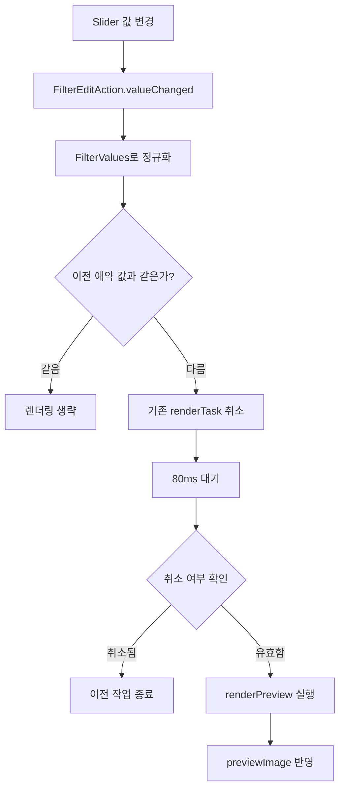

```mermaid
flowchart LR
  A["입력 CIImage"] --> B["CIColorControls<br/>brightness / contrast / saturation"]
  B --> C["CIExposureAdjust<br/>exposure"]
  C --> D["CITemperatureAndTint<br/>temperature"]
  D --> E["CIHighlightShadowAdjust<br/>highlights / shadows"]
  E --> F["CINoiseReduction<br/>noiseReduction"]
  F --> G["CISharpenLuminance<br/>sharpen"]
  G --> H["CIGaussianBlur<br/>blur"]
  H --> I["CIVignette<br/>vignette"]
  I --> J["CIColorMatrix<br/>blackPoint"]
  J --> K["출력 CIImage"]
```
